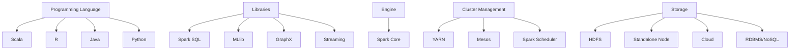
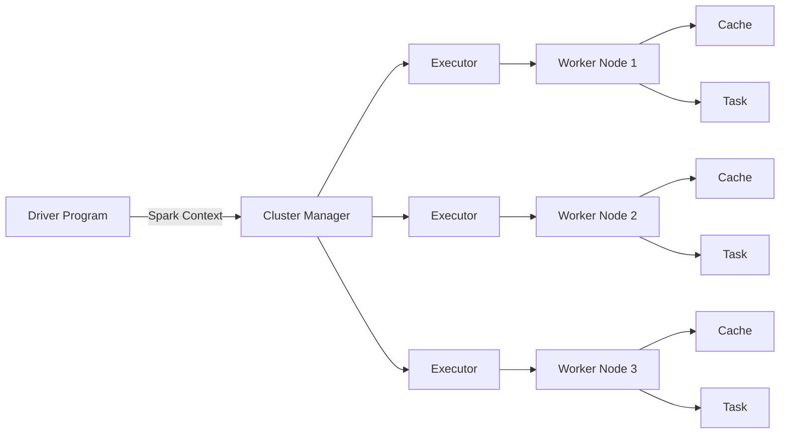

# scala-spark-basics

## Notes

- Spark runs on top of a storage and cluster manager. The storage and cluster manager have various options.
- example => storage:cluster manager:spark (execution engine)
- hadoop:yarn:spark ; machines:mesos:spark ; machines:standalone:spark ; nfs:kubernetes:spark etc
- Spark core is the execution engine of spark. Spark itself has the cluster manager as well in standalone mode, we have the choice to either use it or not. It is used when we are interested only in batch processing and no other benefits of spark, then just take the spark core, it comes with the RDD that can be used for batch processing.
- It depends on the use case. Which part of spark to use is decided based on requirement.
- For sql development: spark sql ; real time data analysis: spark streaming ; machine learning: MLlib ; graph processing: graphx
- Real time application example: detecting credit card frauds.

- Whenever spark environment runs, it needs a cluster manager, Let's say yarn will do this job. Now, yarn will give the resources, cpu, ram. It will give me executors to run my job. Each executor is a combination of RAm and CPU. Its like a container with RAM and CPU assigned to run my job. Depending on the data that you are handling, you can ask the yarn to give you executors, you can tell that this is the number of executors I want and this is the amount of cpu and ram I want in each of them.
- Spark Architecture below

- There is a min and max of cpu and ram predefined for the whole cluster. The demand of the executors should be based on that. 
- There is a partitioning algorithm used in spark for storage of data in the RAM of executors to help in its fast processing. Example, there is a file of 50GB to process, then yarn will decide the number of partitions(number of parts of this file) maybe be x, then decide on the distribution of these partitions among the different executor nodes.
- Based on the amount of data you want to process in one batch decide the executor count, ram and cpu numbers.