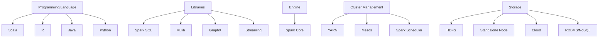
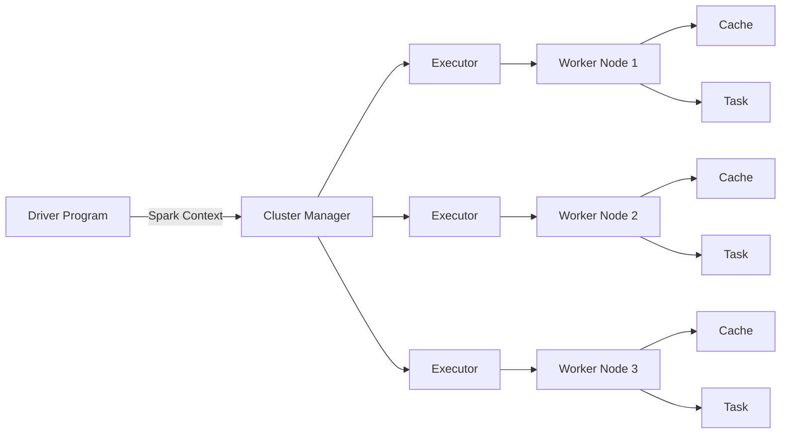

# Scala Spark Basics

## Notes

- Spark runs on top of a storage and cluster manager. The storage and cluster manager have various options.
- example => storage:cluster manager:spark (execution engine)
- hadoop:yarn:spark ; machines:mesos:spark ; machines:standalone:spark ; nfs:kubernetes:spark etc
- Spark core is the execution engine of spark. Spark itself has the cluster manager as well in standalone mode, we have the choice to either use it or not. It is used when we are interested only in batch processing and no other benefits of spark, then just take the spark core, it comes with the RDD that can be used for batch processing.
- It depends on the use case. Which part of spark to use is decided based on requirement.
- For sql development: spark sql ; real time data analysis: spark streaming ; machine learning: MLlib ; graph processing: graphx
- Real time application example: detecting credit card frauds.



- Whenever spark environment runs, it needs a cluster manager, Let's say yarn will do this job. Now, yarn will give the resources, cpu, ram. It will give me executors to run my job. Each executor is a combination of RAm and CPU. Its like a container with RAM and CPU assigned to run my job. Depending on the data that you are handling, you can ask the yarn to give you executors, you can tell that this is the number of executors I want and this is the amount of cpu and ram I want in each of them.
- Spark Architecture below



- There is a min and max of cpu and ram predefined for the whole cluster. The demand of the executors should be based on that. 
- There is a partitioning algorithm used in spark for storage of data in the RAM of executors to help in its fast processing. Example, there is a file of 50GB to process, then yarn will decide the number of partitions(number of parts of this file) maybe be x, then decide on the distribution of these partitions among the different executor nodes.
- Based on the amount of data you want to process in one batch decide the executor count, ram and cpu numbers.

Scala spark installation guide: https://phoenixnap.com/kb/install-spark-on-ubuntu

Follow the below handy commands everytime you open ubuntu to use the spark cluster:

```bash
source ~/.profile
start-master.sh
start-worker.sh -c 2 -m 1G <master-url-copy-from-master-ui>
spark-shell
stop-master.sh
stop-worker.sh
```

- There is a UI for every spark library. Example: spark master, spark worker. When we open the spark shell, the UI of the spark context is enabled.
- Scala supports both object-oriented and functional styles of programming.
- Spark data processing engine is written in scala.
- Features of scala:
- ```Dynamic type inference```, scala can automatically figure out the data type of the variables. If I say a = 10 then the data type of 'a' will automatically become Int.
- Scala supports 2 types of variables: ```immutable using val and mutable using var```.
- ```Static typing```, Once you declare a mutable variable with a data type then cannot reassign it with another data type value. Example: var a = 10 then a = "Ash" => This will throw error. Once a variable is assigned as a Int then reassignment will work only for Int.
- ```Block Expression```, We can write blocks of code enclosed in curly brackets. Can assign the outcome of this block to a variable. Example:
- var answer = {val a = 10; val b = 90; a - b; a + b; a * b}
- Result will be > var answer: Int = 900.
- ```Laziness in scala```, Whenever I declare a variable with keyword lazy, then the compiler will not evaluate the expression, it will evaluate when that variable is explicitly called. Example: Let's try the paste mode in scala to execute multiple lines.
- ```bash
  :paste
  lazy val x = {println("Hi"); 10}
  println("1")
  println(x)
  ```
- The Response will be:
- ```bash
    1
    Hi
    10
    lazy val x: Int // unevaluated
  ```
- Scala program will have 2 parts: driver and business logic. The driver program is the main method and the business logic is written in separate functions. All the settings you need to run your code are a part of the driver program.
- In java the main method (or the driver) is a static method inside a static class. But in scala, the driver will be written inside a singleton object which is same as the java static class.
- Instead of static classes, scala has singleton object.
- ```Call by value```, Function arguments are considered call by-value by default in Scala. First, it evaluates all the function arguments, from left to right. Then it replaces the function application by the function’s right-hand side, and, at the same time, it replaces the formal parameters of the function by the actual arguments. The call by-value strategy has the advantage that it evaluates every function argument only once.
- ```Call by name```, To make an argument called by-name, we simply prepend => (rocket symbol) to its type. Call by-name evaluation is similar to call by-value, but it has the advantage that a function argument won’t be evaluated until the corresponding value is used inside the function body.
- ```Higher order functions```, any function which can accept another function as an input argument. For example, map. Map is a built-in higher order function, you can create your own as well.
- ```Anonymous functions```, they have only one input then => rocket symbol then output. example i => i * 2.
- ```Collections```, group of elements. Example: Array, ArrayBuffer, Map, Tuple and List.